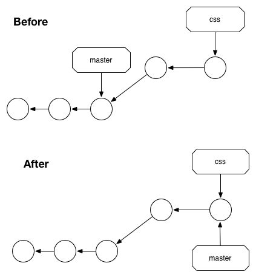
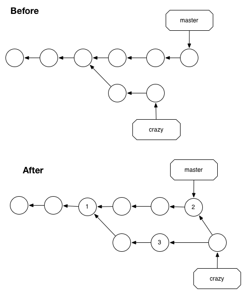

# The Branch Model

Topics
* creating
* fast-forward merge
* 3-way merge
* squash merge (git rebase -i)
* conflicts
* git bisect
* git stash


In Git, a branch is an independent line of development. branch features:

1. an error-proof method for incorporating changes from an experiment
2. they let you store all of your experiments in a single directory, which makes it much easier to keep track of them and to share them with others
3. allow several standardized workflows for both individual and collaborative development


The HEAD is Git’s internal way of indicating the snapshot that is currently checked out. 

git log - will only show the current branch so checking out different branches will produce different results. A linear history


#### via http://stackoverflow.com/a/5772882/152825
Might get a detached head situation 
would identify via git symbolic-ref HEAD

The important thing to remember with a detached HEAD is that if the commit it points to is otherwise unreferenced (no other ref can reach it), then it will become “dangling” when you checkout some other commit. Eventually, such dangling commits will be pruned through the garbage collection process (by default, they are kept for at least 2 weeks and may be kept longer by being referenced by HEAD’s reflog).


------------

## Merging
two main types (1) fast-forward and (2) 3 way merge; chosen for you automatically

#### fast-forward merge
merging a branch in moves HEAD to the tip of the merged in branch; doesnt recreate commits. This is called a "fast-forward merge"




Temporary branches like the latter are called topic branches because they exist to develop a certain topic, then they are deleted. We’ll work with two types of topic branches later in this module.


when looking at:
````
git log --oneline --graph
````
a fast forward merge will not show the other branch. HEAD literatlly has just been pushed forward.

-------------

#### 3-Way Merge / recursive


if you can not just move HEAD to the tip of the developed branch (ie a fast-forward merge), then you are going to do a 3-way merge which will create a merge commit.





A 3-way merge occurs when you try to merge two branches whose history has diverged. It creates an extra merge commit to function as a link between the two branches. As a result, it has two parent commits. The above figure visualizes this with two arrows originating from the tip of crazy. It’s like saying “this commit comes from both the crazy branch and from master.” After the merge, the crazy branch has access to both its history and the master history (this seems really confusing and counter-intuitive).


````
git log --oneline 
````

--------------


object store picture VCG37

git uses a directed acyclic graph (DAG); two important properties: VCG75

  1. the edges within the graph are all directed from one node to another
  2. starting at any node in the graph, there is a no path along the edges that leads back to the starting node

git implements the history of commits within a repository as a DAG. In the commit graph, each node is a single commit and all edges are directed from one descendant node to another parent node, forming an ancestor relationship VCG75


merge commit - has two (or more) commit parents VCG77
can run gitk to see a representation of merges

number of parent commits:

  1. 0 - initial commit
  2. 1 - normal commit
  3. 2+ - merge commit

is no permanent record of branch start points but Git can algorithmically determine them via the git merge-base command VCG78

-------------

#### staging / staging a file 


A branch in Git is simply a lightweight movable pointer to one of these commits. The default branch name in Git is master. As you start making commits, you’re given a master branch that points to the last commit you made. Every time you commit, it moves forward automatically.

The “master” branch in Git is not a special branch. It is exactly like any other branch. 

How does Git know what branch you’re currently on? It keeps a special pointer called HEAD.


-------------------

#### BRANCHES

````
git branch my-new-branch # creates a branch
git checkout -b another-new-branch # creates and checks out another-new-branch
````

branches are simply pointers to certain commits

````
$ git log --oneline --decorate
$ git log <comit> # will show history from that position
````

and some stats 

````
$ git log --stat
$ git log -1 -p  HEAD~1 # shows spefic changes for that commit
````

Switching branches changes files in your working directory
It’s important to note that when you switch branches in Git, files in your working directory will change. If you switch to an older branch, your working directory will be reverted to look like it did the last time you committed on that branch. If Git cannot do it cleanly, it will not let you switch at all. -???


To show the graph:

````
$ git log --oneline --decorate --graph --all
````

Because a branch in Git is in actuality a simple file that contains the 40 character SHA-1 checksum of the commit it points to, branches are cheap to create and destroy. Creating a new branch is as quick and simple as writing 41 bytes to a file (40 characters and a newline).


HEAD
can get current head via:

````
git rev-parse HEAD 
````


you can see all your branches via  

````
git branch -a
git branch -v
git branch --no-merged
git branch --merged
git branch --contains <commit>   #tell you all the branches that have the given commit in their history
`````

will show both local and remote branches

"origin" is not special

Pushing
Tracking Branches


#### Merging
you merge into a branch


will force a non-fast-forward merge - why would you do this?
````
git merge --no-ff <branch-name>
`````

http://stackoverflow.com/questions/26384166/what-is-the-difference-between-merging-master-into-branch-and-merging-branch-int/26384695#26384695


#### Conflicts
if you do not want to deal, just abort with
git merge --abort

to see differences,
git diff --ours
git diff --theirs 
or from the base with
git diff --base

allow you to pick whose you want
you need to add the file after editing


#### how to fix a bad merge
reset the head to the previous state
if you follow the errant `git merge` with `git reset --hard HEAD~`

problem with this is that if other people have the commits you are rewriting, you should avoid reset. This approach also will not work if any other commits have been created since the merge; moving the refs would effectively lose those changes.


----------

````
git ls-files
git ls-remote
````

------------
Finding Commits
git bisect VCG83

what is a HEAD?

Commits VCG44

A detailed view of Git's object model and files VCG60

Squash Merges VCG147
