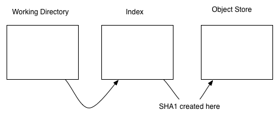
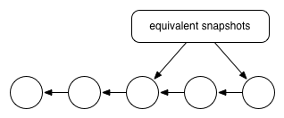

# The commit model

STAGING A COMMIT
What is a snapshot?

Topics

* 3 states a file can be in
* staging a commit
* series of commits
* parent_id / no knowledge of children
* changeset
* HEAD - relative movement
* remedial branching
* log
* reflog
* tagging
* git reset / git clean

### different stages of tracking

untracked -> tracked -> staged

Files / Working Directory ---- Stage ---> Staged Snapshot ---- Commit -----> History / Committed Snapshots

commit hash id is created here





  * working directory
  * index
    * use git diff to see wd, and git diff --cached to see index
  * object store


Git’s term for creating a snapshot is called staging because we can add or remove multiple files before actually committing it to the project history. Staging gives us the opportunity to group related changes into distinct snapshots—a practice that makes it possible to track the meaningful progression of a software project (instead of just arbitrary lines of code).


````
$ git status
$lstime 100 # shows which most recent 100 files have been modified

````


````
git diff  # will show you whats different in working directory but not yet in index
git diff --cached # will show you whats different in index but not yet in object store
````

### what is a reference?

##### refs and symrefs VCG68
refer to head
relative movement

Specials variables:

  * HEAD
  * ORIG_HEAD
  * FETCH_HEAD
  * MERGE_HEAD

git symbolic-ref <symref> #VCG69

referencing commits relatively - ^1 == different paretnts, and ~1 means go back to previous commits

example of using 

`````
git show-branch --more=35
git show-branch --more=35 -a # shows tracking branches
`````

"The command git rev-parse is the final authority of translating any form of commit name --tag, relative, shortened, or absolute -- into an actual, abbsolute commit hash ID within the object database" VCG71

to show a commit

```` 
$git show HEAD~2
or 
$git show origin/master:config.rb
````

### what is a commit? 

````
lstime 100
````

How is the commit id computed?

When you make a commit, Git stores a commit object that contains a pointer to the snapshot of the content you staged. This object also contains the author’s name and email, the message that you typed, and pointers to the commit or commits that directly came before this commit (its parent or parents): zero parents for the initial commit, one parent for a normal commit, and multiple parents for a commit that results from a merge of two or more branches.

"When a commit occurs, Git records a snapshot of the index and places that snapshot in the object store" VCG65


stage a snapshot to commit - "A snapshot represents the state of your project at a given point in time", can revert this snapshot

### series of commits


As you may remember from Getting Started, Git doesn’t store data as a series of changesets or differences, but instead as a series of snapshots (what is a snapshot?)


after adding you can do:

````
git reset HEAD <file>
````
to unstage

#### HEAD
where we are in this series of commits is called HEAD and the reference can be acquired via 

````
git rev-parse HEAD
````
There can be only one HEAD at a time. In other words it provides an absolute navigation point like North on a compass. Unlike a direction on a compass, it is movable.  

This is a bit confusing as HEAD seems to imply a fixed location such as a head of the line. While, in practice, this is often the case. HEAD is more like a 'current location' that you are at and not a fixed location. 

#### basic going back in time 
to get an old version:

`````
git checkout aabbccd
git show aabbccd
`````

if you go back in time, you will get a detached head. The commits that you dont see exist on the master branch so you need to just check that out to get those commits back.

ways to move around; caret and tilde syntax (http://stackoverflow.com/questions/2221658/whats-the-difference-between-head-and-head-in-git); 

caret refers to different parents that can result from a 3-way merge

HEAD~1
HEAD^^


#### Tagging a Release

````
git tag -a v1.0 -m "Stable version of the website"
```` 

#### View Binary File
````
xxd -b ./name.txt # view a binary of a file
xxd ./name.txt  # hex version
````
#### Undoing a Commit

````
git revert 514fbe7
````

specify the commit you want to undo; think of git revert as creating a new commit at that point




#### Goes back to previous state:

````
git reset --hard
````
undoes all tracked files to match the most recent commit

````
git reset --hard HEAD^
````


#### Removes unstaged files

````
git clean -f
````

#### cherry-pick
another way to manipulate commits is via git cherry-pick

allows you to bring a single commit from another branch
However, cherry-picked commits have different commit id's than the original commit (other examples where that's the case - a commit ID is based partially on where it exists in the history and changing the parent commit changes the commit ID)

A good rule of thumb is to cherry-pick commits only when a merge is not an option

normally creates a new commit as soon as it is done; can do differently via -e for edit tag or --no-commit (or -n); allows several commits to be done and then merged as a single commit

````

> git cherry-pick <somecommitid>
> git cherry-pick -e <somecommitid>

````
