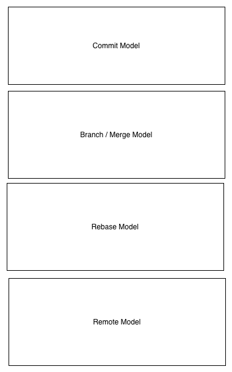

Git in an hour

#### refs 
http://rypress.com/tutorials/git/index RP
Version Control with Git VCG
http://git-scm.com/book/en/v2/


I come here from casual user to a power user.

4 models that I think you need to understand to understand git deeply. 

They are:
1. the commit model 
2. the merge / branch model 
3. the rebase model
4. the remote model 

1. the commit model - will introduce the main abstractions; take a single file through the different stages, snapshot, staging a commit
   commit object; tip of a branch, HEAD
   
   1.  what is a commit?
   2. commit parent? 
   3. index 
   4. git status
   5. git log
   6. git reflog 
   7. git checkout 
   8. git tag; lightweight and heavyweight
   9. git revert <tagid>
   
   
2. the merge / branch model - two main types of merging (1) fast-forward merge and a (2) three way merge3. 
   1.  git branch
   2. git checkout -b 
   3. git stash
   
3. rebase - allows for rewriting history and creating 

4. remote model - allows for rewriting history and creating 


1. states that your data can be in
2. branching
3. moving states to branches, moving states to other branches, and branches to branches 
4. navigating branches
5. remote workflow

the jQuery principle - when it comes to manipulating the DOM, you can do it

The snapshot - what is a snapshot? 





````
$git init
````


  * creates a .git subidirectory


can see the changes via lstime  


branching, merging, moving around, rebasing, reflog, cherry-pick
  
  
http://git-scm.com/book/en/v2/Git-Branching-Branches-in-a-Nutshell


=======

  

------------
basic configuring:

````
git config --global user.name "Your Name"
git config --global user.email your.email@example.com
`````

Git does a fair amount of logical shortcutting - both a blessing and a curse.


=======
.gitignore


