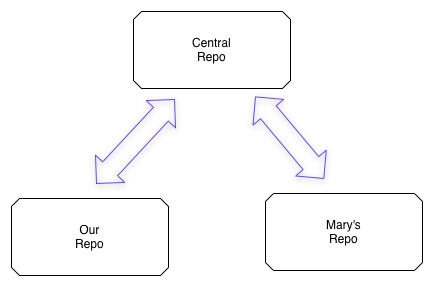
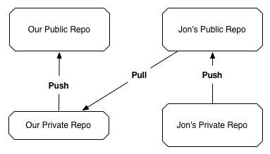

# The Rebase Model


#### Remote Setup
Centralized Model




Fully Distributed Model




Really, a semantic difference. 


#### Reset
Git reset changes your repository and working directory to a known state. Specifically, git reset adjusts the HEAD ref to a given commit and, by default, updates the index to match the commit.  VCG154 

the command takes three main options --soft, --mixed, and --hard

doing a git checkout <sha1> will put you into a detached head state; should probably use a git reset --soft/--hard <sha1> to move back in time

#### Rebasing
Rebasing lets us move branches around by changing the commit that they are based on.

differs from cherry-pick 

An alternative to merging - with the rebase command, you can take all the changes that were committed on one branch and replay them on another one.


Rebasing replays changes from one line of work onto another in the order they were introduced, whereas merging takes the endpoints and merges them together.


rebase makes for a cleaner history (when using the --graph option)

#### rebase and then merge (ie remove the merge commit )
rebasing allows you to bring in the changes from another branch and then merge back in. This makes it possible to do a fast-forward merge and thus reduce a merge commit. 


#### using rebase clean-up commit history (squash merge)


to show a difference in a commit? VCG26

forward porting


rebasing allows us to:
split up commits, revive lost snapshots, and completely rewrite a repository’s history to our exact specifications.

Before we merge into the master branch, we should make sure we have a clean, meaningful history in our feature branch. By rebasing interactively, we can choose how each commit is transferred to the new base.


---------------

git cherry-pick 
"It will introduce a new, distinct commit. Strictly speaking, using git cherry-pick doesn't alter the existing history within a repsoitory; instead it adds to the history" VCG161

a tricky command as it is just placing it at the end of the line 

----------------

Squash Merge VCG147


#### Squash Merge
there are two ways, the easy way and the hard way
add to another branch, merge in, reset to origins state, git add --all, git commit


##### Squash - easy
git merge --squash  # but be careful
add to another branch, merge in, reset to origins state, git add --all, git commit


##### Squash - hard
use rebase


#### rewriting history https://git-scm.com/book/en/v2/Git-Tools-Rewriting-History
1. git commit --amend
2. git rebase -i HEAD~3 // hard way above; important point is not to do this way if you have already shared

--------------

#### stash 

"the stash is a mechanism for capturing your work in progress, allowing you to save it and return to it later when convenient" VCG181

a stash is a regular commit object

````
 git stash list # lists  the changes 
 git stash show # shows  the changes 
 git stash apply # apply the chagnes? - not sure if this works the way you think it does
 git stash pop # apply the chagnes and remove from the stash

````

in the reflog, will create stash@{<revision>}

#### reflog

````
git reflog -10
````

Git Porcelain
