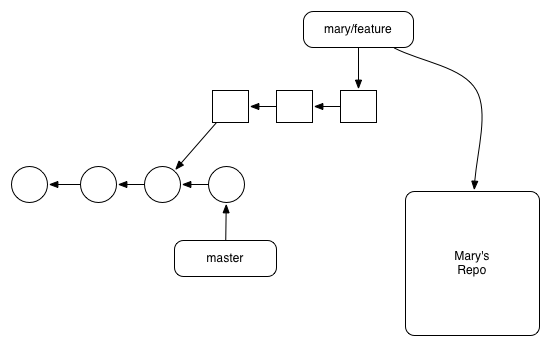

##### Remotes

Simply put, a remote repository is one that is not your own. It can be another Git repository that’s on your company’s network, the internet, or even your local filesystem, but the point is that it’s a repository distinct from your my-git-repo project.


We’ve already seen how branches can streamline a workflow within a single repository, but they also happen to be Git’s mechanism for sharing commits between repositories. Remote branches act just like the local branches that we’ve been using, only they represent a branch in someone else’s repository.


look at current remote branches:

````
git branch -r
`````





you have tracking branches and remote tracking branches - diagram them out visually
  they are about local development but also have implications for the server; a remote tracking branch recieves data from the server and a tracking branch is what you write to
